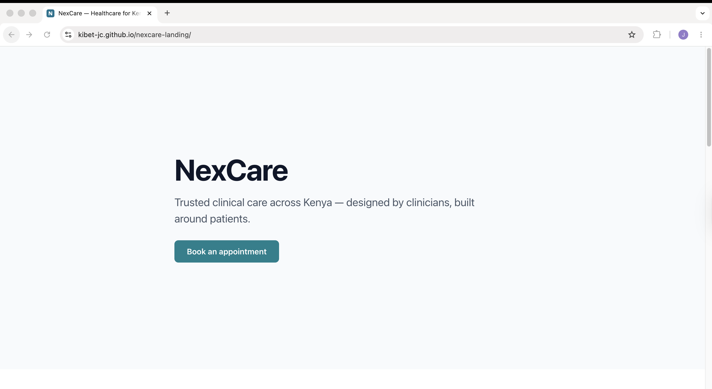
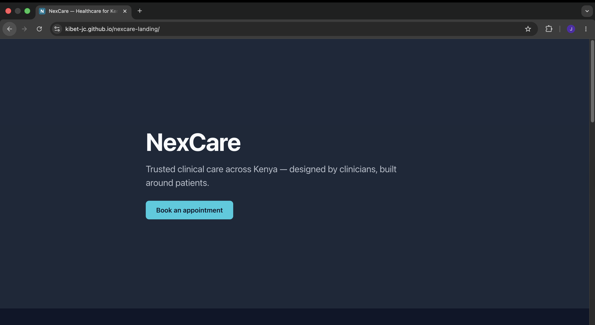
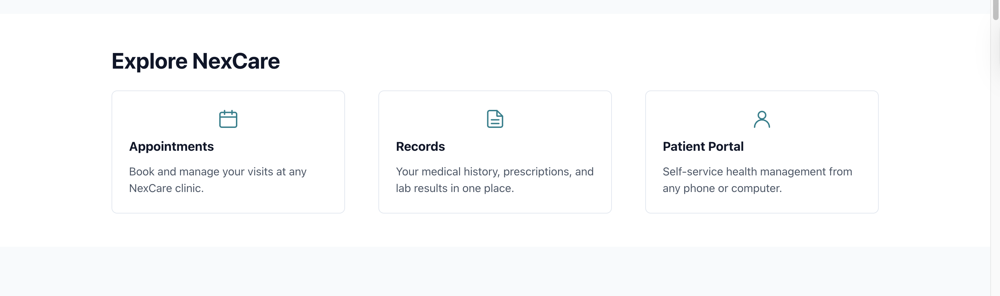
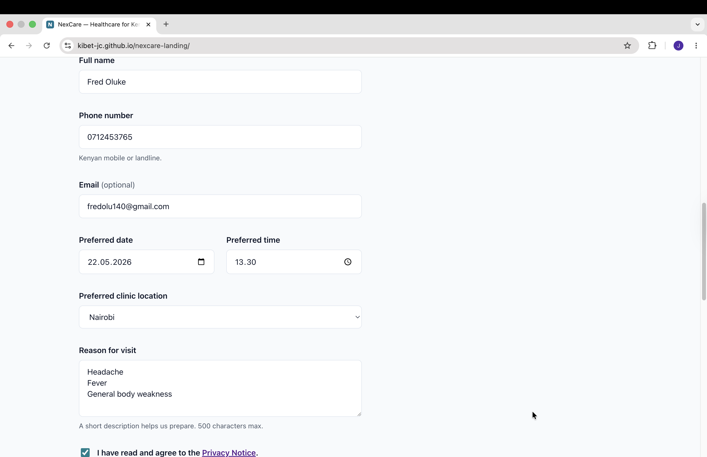
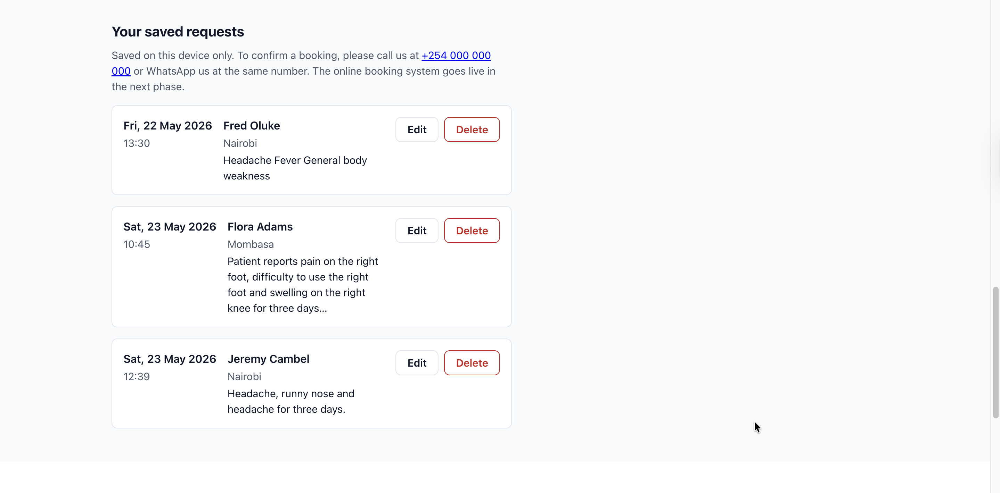
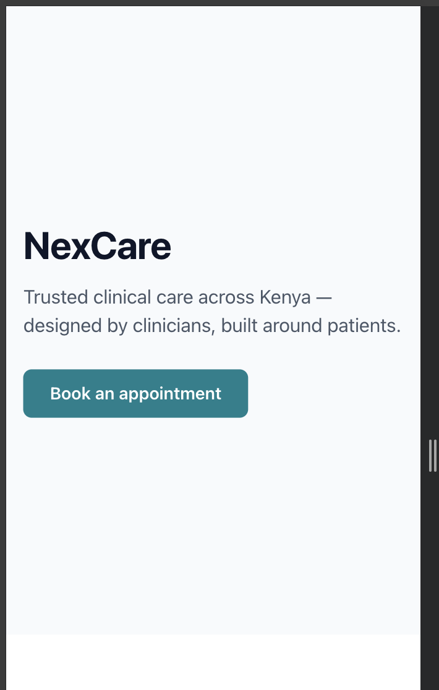
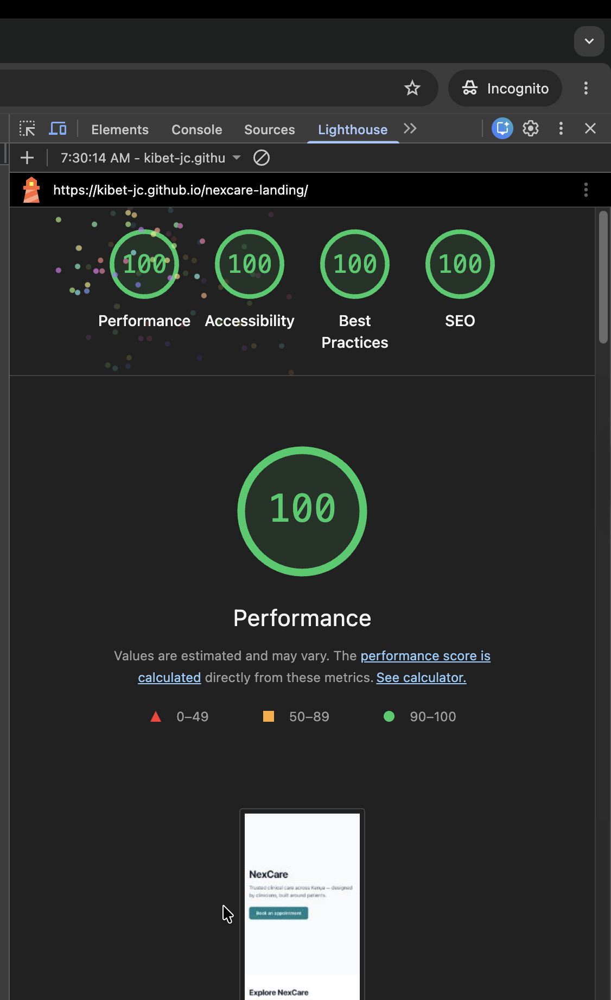

# Elara Healthcare — Landing Site

**Live site:** https://kibet-jc.github.io/nexcare-landing/



NexCare is a Health Information Management System (HIMS) and Electronic Health Record (EHR) for a Kenyan clinic chain, operated by a registered Clinical Officer. This repository is the public-facing landing site only; the clinical core and patient-facing modules live in separate repositories on the NexCare module ladder.

---

## About NexCare

NexCare is a clinical operations platform for primary and secondary care in Kenya, covering appointment booking, patient records, clinician workflows, and reporting into national systems including the Social Health Authority (SHA / SHIF) and the Ministry of Health. The platform is built and operated by **Kibet**, a registered Clinical Officer in Kenya, in partnership with established Kenyan hospital partners. Elara Healthcare operates under the **Kenya Data Protection Act, 2019** and the **Health Act, 2017**, and is registered with the Office of the Data Protection Commissioner (ODPC) as outlined in [COMPLIANCE.md](./COMPLIANCE.md). Modules move to production progressively under the per-module readiness gates defined in `COMPLIANCE.md` §12. This repository contains the landing site only; the clinical core (`nexcare-api`), the patient + clinician web app (`nexcare-web`), and the appointment intake module (`nexcare-appointments-client`) are tracked separately.

---

## Live site

| | |
|---|---|
| Production URL | https://kibet-jc.github.io/nexcare-landing/ |
| Hosting        | GitHub Pages |
| Deploy         | Auto on push to `main`, see [Deploy](#deploy) |
| Status         | Phase 1 — informational landing only; online booking submits to the local device only until Phase 2 |

---

## Screenshots

### Desktop

| | |
|---|---|
|  |  |
| Hero (light) | Hero (dark) |
|  |  |
| Modules teaser | Appointment form |
|  | |
| Saved requests list | |

### Mobile



### Quality



Lighthouse on the live URL, mobile profile.

---

## Stack

- **HTML5** with semantic landmarks (`header`, `nav`, `main`, `section`, `article`, `footer`) and WAI-ARIA where it adds meaning.
- **CSS3** with CSS custom properties (light + dark token sets driven by `prefers-color-scheme`), BEM-style class names, and a small base + layout + components split. No preprocessor.
- **Vanilla JavaScript** (ES2022 modules, no bundler), split into a pure validation module and a swappable persistence/state module so the Phase 2 API can replace `localStorage` by changing one file.
- **GitHub Pages** for hosting, deployed via **GitHub Actions**.
- No third-party trackers and no analytics in Phase 1.

---

## Run locally

```bash
git clone https://github.com/Kibet-JC/nexcare-landing.git
cd nexcare-landing
npx serve src
# Open http://localhost:3000
```

> ES modules require a server; opening `src/index.html` directly with `file://` will not work.

---

## Deploy

- Pushes to `main` trigger `.github/workflows/deploy.yml`.
- The workflow uploads `src/` as a Pages artifact and deploys via the official `actions/deploy-pages` action using the default `GITHUB_TOKEN`. There is no build step.
- One-time setup (already done): repo **Settings → Pages → Source** is set to **"GitHub Actions"**.
- Manual re-deploy: **Actions** tab → **"Deploy to GitHub Pages"** workflow → **"Run workflow"** (`workflow_dispatch`).

---

## Roadmap

NexCare is built as a sequence of modules. This repository is module 1.

| # | Module | Repository | Status |
|---|---|---|---|
| 1 | Public landing site | `nexcare-landing` | **Live** |
| 2 | Client-side appointment intake (extracted into its own module) | `nexcare-appointments-client` | Planned |
| 3 | Clinical API (Node + Postgres + Prisma) | `nexcare-api` | Planned |
| 4 | Patient + clinician web app (React) | `nexcare-web` | Planned |
| 5 | Auth + RBAC + audit logs | extends API + web | Planned |
| 6 | AI-assisted clinical note summarization (server-side) | new module | Planned |

---

## Known limitations

- Online booking submissions persist on the visitor's device only; Phase 2 introduces the real API and submits to the clinic system.
- Only the Eldoret clinic is bookable today (telemedicine first); Nairobi and Mombasa appear in the selector as "coming soon" and cannot be selected until those clinics open.
- The Privacy Notice link points to the GitHub-rendered `PRIVACY.md`; a dedicated `/privacy` page on the site is tracked as a separate issue.
- Custom domain is not yet configured; the site is served from `kibet-jc.github.io/nexcare-landing/` during Phase 1.

---

## Compliance, privacy, security

Elara Healthcare is operated under the laws of the Republic of Kenya, including the **Data Protection Act, 2019** and the **Health Act, 2017**. The lead clinician is a registered Clinical Officer.

- [Compliance overview](./COMPLIANCE.md) — Kenya DPA / ODPC, sub-processors, retention
- [Privacy notice](./PRIVACY.md) — patient-facing, plain language
- [Security policy](./SECURITY.md) — vulnerability reporting, incident response

To report a security vulnerability, please follow the process in [SECURITY.md](./SECURITY.md).

---

## Contact

| | |
|---|---|
| Project lead / Clinical Officer | Kibet |
| Email | kibet@jeremiahchebii.net |
| GitHub | [@Kibet-JC](https://github.com/Kibet-JC) |
| Privacy / DPO enquiries | privacy@elarahealthcare.co.ke |
| Security disclosure | security@elarahealthcare.co.ke |

---

© 2026 Kibet (Elara Healthcare). All rights reserved. See [LICENSE](./LICENSE).
